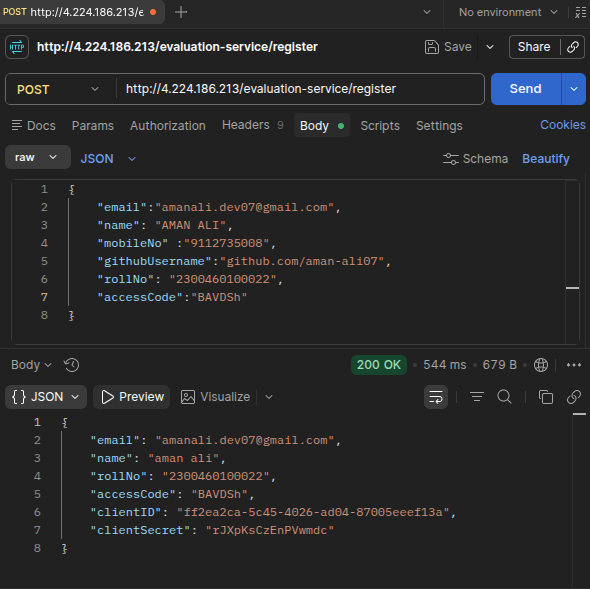
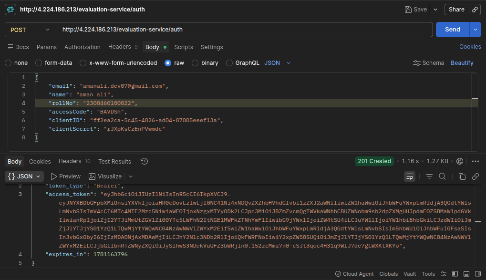
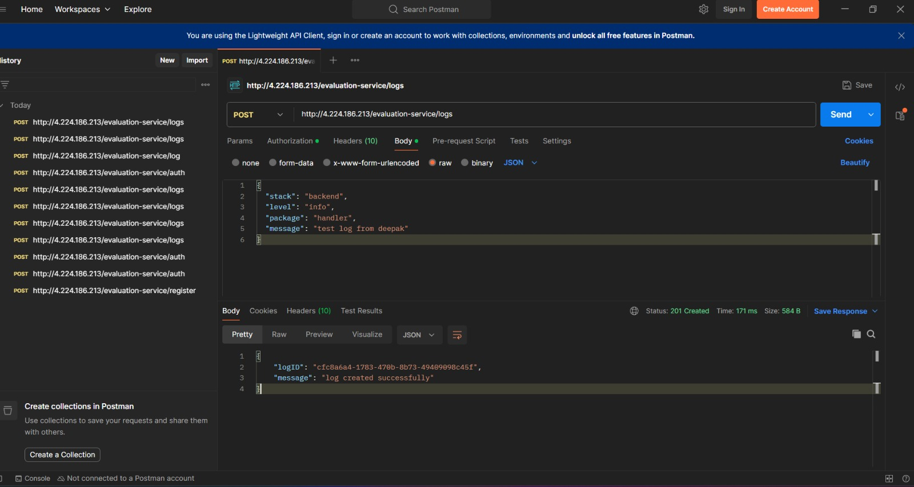

# Notification Platform

Campus hiring evaluation project.

## Structure

- logging-middleware/
- notification_app_be/
- notification_app_fe/
- notification_system_design.md
- screenshot/

## Screenshots

### Registration API Call


### Authorisation API Call


### Evaluation Logs (Phone)


### Evaluation Logs (WhatsApp)


## Getting Started

```sh
cd notification_app_be
npm install
npm run dev
```

```sh
cd notification_app_fe
npm install
npm run dev
```

Backend runs on port 5000, frontend on port 3000.
