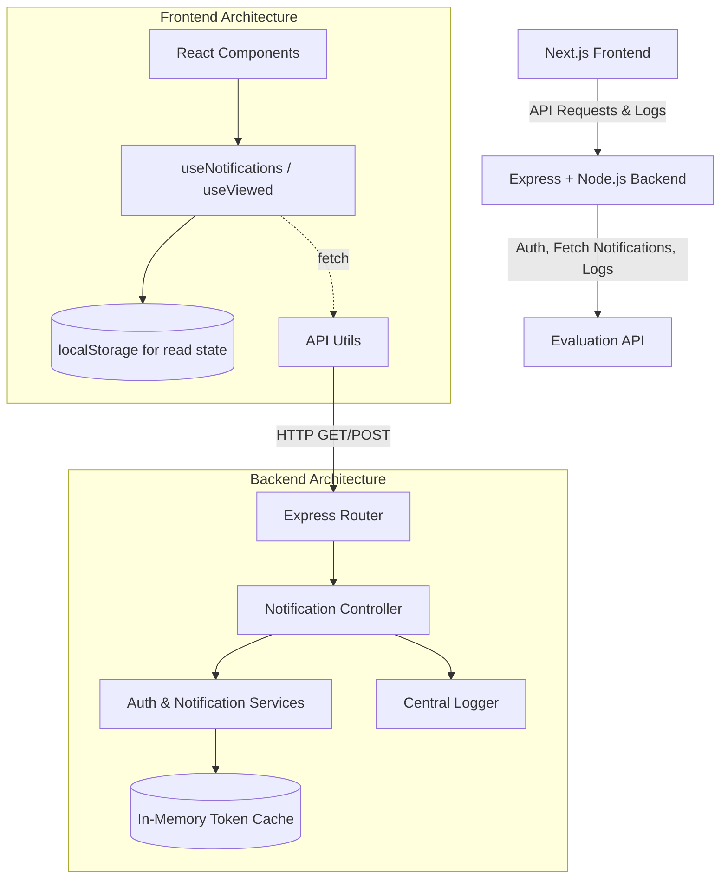

# Campus Notification Platform

A full-stack real-time campus notification platform built for evaluation purposes.

## Architecture & Data Flow



## Engineering Thought Process

This project was built with a senior-level, production-ready mindset. Every decision optimizes for security, reliability, and maintainability:

1. **Zero-Trust Frontend:** 
   The frontend is completely isolated from Evaluation credentials. It never sees the API keys or the Bearer token. To achieve this, the Node.js backend acts as a proxy. Even frontend logs are POSTed to our backend, which then attaches the secure token and forwards them to the remote Evaluation logging service.
   
2. **Fail-Fast Configuration:**
   The backend validates all required environment variables (`src/config/env.ts`) before starting the Express server. If a secret is missing, it crashes instantly during startup rather than throwing cryptic errors hours later when an endpoint is hit.

3. **Abstracted Token Lifecycle:**
   Authentication isn't scattered throughout the app. The `authService.ts` handles the initial handshake and maintains an active token in memory. It uses a 5-minute buffer—if a token is about to expire, it automatically refreshes *before* returning it to the caller. The rest of the app never worries about auth headers.

4. **Algorithmic Priority Sorting:**
   Stage 6 requires a Priority Inbox. Instead of basic sorting, we use a decaying formula: `score = importance_weight / (age_in_hours + 1)`. For live streaming notifications, we don't hold thousands of items in memory to sort them. We use an O(N) insertion approach (`PriorityInbox` class) that strictly maintains the top `N` items.

5. **O(1) Client-Side Read Tracking:**
   Tracking which notifications are "read" happens via a `Set` persisted to `localStorage`. This avoids punishing the backend with thousands of write requests when a student scrolls their feed, and gives the UI zero-latency `O(1)` lookups to render the "new" badge.

---

## Project Structure

```text
.
├── notification_app_be/     # Express + TypeScript backend
├── notification_app_fe/     # Next.js + Material UI frontend
├── priority_inbox/          # Stage 6: Standalone priority inbox script
└── notification_system_design.md  # System design document (Stages 1–6)
```

## Quick Start

### Backend

```bash
cd notification_app_be
npm install
cp .env.example .env
# Fill in your credentials in .env
npm run dev
```

Server starts at: `http://localhost:5000`

### Frontend

```bash
cd notification_app_fe
npm install
cp .env.example .env.local
# Set NEXT_PUBLIC_BACKEND_URL=http://localhost:5000
npm run dev
```

App runs at: `http://localhost:3000`

### Stage 6 — Priority Inbox Script

```bash
cd priority_inbox
npm install
npm start
```

## API Endpoints

| Method | Endpoint | Description |
|--------|----------|-------------|
| GET | `/api/notifications` | All notifications (supports `?limit`, `?page`, `?notification_type`) |
| GET | `/api/notifications/priority` | Top N by priority (`?n=10`, `?notification_type`) |
| POST | `/api/log` | Proxy log endpoint for frontend |
| GET | `/health` | Server health check |

## Tech Stack

- **Backend**: Node.js, Express, TypeScript
- **Frontend**: Next.js 14, React 18, Material UI v5, TypeScript
- **Design**: Priority scoring algorithm, localStorage-based read tracking
